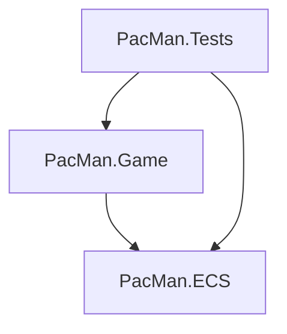
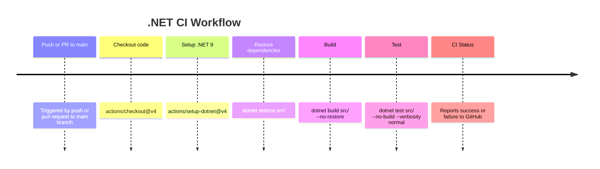

# Pac-Man-Learning

[TOC]

Welcome to the **Pac-Man-Learning** repository!  
This project is a modern, testable, and extensible implementation of the classic Pac-Man game in C#, designed for the command line and built to help you learn:

- **C#**
- **Clean Code**
- **SOLID principles**
- **The Entity Component System (ECS) pattern**
- **Unit and integration testing**
- **Test-Driven Development (TDD)**
- **Rich console UI with Spectre.Console**

---

## 🚀 Project Purpose

This repository is intended as a **learning resource** for developers interested in:
- Writing maintainable C# code
- Applying SOLID and Clean Code principles in real-world scenarios
- Understanding and implementing the ECS pattern
- Building testable and modular applications using Test-Driven Development (TDD)
- Experimenting with console rendering and input handling
- Leveraging Spectre.Console for beautiful, modern console UIs

---

## 🎮 Features

- **Classic Pac-Man gameplay**: Move, collect dots, avoid ghosts, win or lose!
- **Entity Component System architecture**: Decouples data, behavior, and identity for maximum flexibility and testability
- **Clean, SOLID codebase**: Each class and method has a clear, single responsibility
- **Two rendering modes**: Emoji (colorful, modern) and ASCII (maximum compatibility)
- **Command-line options**: Choose your render mode at startup
- **Comprehensive tests**:Unit and integration tests using NUnit and AwesomeAssertions, written following TDD practices
- **Easy extensibility**: Add new features, systems, or components with minimal changes

---

## 🧑‍💻 Learning Outcomes

By exploring this project, you will:

- **Understand the ECS pattern**: Learn how to separate entities, components, and systems for scalable game (or app) design
- **Apply SOLID principles**: See how Single Responsibility, Open/Closed, and other SOLID principles work in practice
- **Write and run tests using TDD**: Discover how to write unit, integration, and E2E tests for a console application, and how TDD leads to better code quality
- **Handle command-line arguments**: Learn how to make your apps configurable and user-friendly
- **Work with console input/output**: See how to create interactive C# console applications
- **Use Spectre.Console**: Build visually appealing console UIs with modern .NET tools
- **Practice TDD**: Experience the full TDD cycle—writing failing tests, making them pass, and refactoring with confidence

TDD (Test-Driven Development) is a core practice in this repository.
You’ll find examples, guides, and real workflow demonstrations (such as the warp tunnel feature) showing how to apply TDD to game features, making the codebase safer, more modular, and easier to extend.

---

## 🚫 Topics Not Covered in This Repository

While this project provides a comprehensive and clean implementation of the classic Pac-Man game using the Entity Component System (ECS) pattern and modern C# practices, it intentionally does not cover certain advanced or unrelated topics, including but not limited to:

- **Graphics Programming and Rendering:** This project uses a console-based UI powered by Spectre.Console and does not delve into graphics programming, GPU rendering, or game engine graphics pipelines.
- **Advanced Game Physics:** There is no physics engine or complex collision detection beyond simple grid-based movement and collision.
- **Networking and Multiplayer:** The game is single-player and does not include any networking or multiplayer features.
- **Audio Programming:** Sound effects or music are not implemented.
- **Artificial Intelligence Beyond Basic Ghost Movement:** The ghost AI is basic and does not include advanced pathfinding or machine learning.
- **Platform-Specific Optimizations:** The code is designed for cross-platform console applications and does not include platform-specific optimizations or native integrations.

This focus allows the repository to remain a clear and educational resource for learning ECS, clean code, and C# console application development.

---

## 🚦 Test-Driven Development (TDD) in This Repository
### What is TDD?
Test-Driven Development (TDD) is a software development approach where you:

- Write a failing test that describes a small piece of desired functionality.

- Write the minimum code needed to make the test pass.

- Refactor the code, keeping all tests green.

- Repeat for each new feature or improvement.

TDD helps you:

- Focus on clear, testable requirements.

- Catch bugs early.

- Encourage modular, maintainable code.

- Build confidence to refactor and extend your codebase.

## 🏃 TDD in Action: Implementing the Warp Feature
Let's demonstrate TDD using the warp tunnel feature from Pac-Man.

### Step 1: Write a Failing Test
First, we write a test that describes the desired behavior:
When the player or a ghost moves onto a warp tile, they should appear at the matching warp tile on the same row.

For this, we need to add some logic to the `MazeService`.

Start by implementing the test, which will fail, because we didn't implement `MazeService.TryGetWarpDestination` yet.

```csharp
[Test]
public void TryGetWarpDestination_Returns_CorrectDestination_WhenWarpPortalContainsSourceAndDestination()
{
    // Arrange: add two warp entities in row 5 at (0,5) and (27,5)
    var leftWarp = _world.CreateEntity();
    _world.AddComponent(leftWarp, new WarpPortalComponent());
    _world.AddComponent(leftWarp, new PositionComponent((0, 5)));
    var rightWarp = _world.CreateEntity();
    _world.AddComponent(rightWarp, new WarpPortalComponent());
    _world.AddComponent(rightWarp, new PositionComponent((27, 5)));

    var mazeService = new MazeService(_world);

    // Act
    var result = mazeService.TryGetWarpDestination(0, 5, out var newPos);

    // Assert: newPos should be (27,5) and result should be true
    result.Should().BeTrue();
    newPos.Should().Be((27, 5));
}
```

### Step 2: Implement the Minimum Code to Pass the Test
Now, implement the warp logic in MazeService so the tests pass:

```csharp
public bool TryGetWarpDestination(int x, int y, out (int x, int y) destination)
{
    // Find all warp entities in the same row
    var warpEntities = world.GetEntitiesWith<WarpPortalComponent>()
        .Select(world.GetComponent<PositionComponent>)
        .Where(component => component.Position.Y == y)
        .ToList();
    
    destination = (x, y);
    if (warpEntities.Count < 2)
        return false; // No warp or only one warp in this row

    // Find the other warp position in the same row
    destination = warpEntities
        .Select(component => (component.Position.X, component.Position.Y))
        .FirstOrDefault(pos => pos.X != x);
    
    return destination != default;
}
```

Run the tests again—they should now pass (green).

### Step 3: Refactor and Extend
With the tests green, you can safely refactor or extend the feature, knowing the tests will catch regressions.

## 🧑‍💻 How to Practice TDD in This Repository
- Add a test for every new feature or bug fix before writing the implementation.

- Run the tests to see them fail.

- Write the minimal code to make the test pass.

- Refactor as needed, keeping all tests green.

- Commit your tests and implementation together.

This workflow helps ensure robust, maintainable, and well-documented code.

TDD is not just a technique—it's a mindset that leads to better design and higher confidence in your code. Give it a try as you contribute or experiment with this Pac-Man project!

## 🖥️ Console UI Powered by Spectre.Console

This project uses [Spectre.Console](https://spectreconsole.net) to create a beautiful, modern, and interactive console user interface.

**Why Spectre.Console?**
- Enables rich text formatting (colors, styles, emojis, tables, panels, and more).
- Provides widgets like tables, trees, progress bars, charts, and custom panels for a delightful console experience.
- Makes it easy to display game states, scores, and messages in a visually appealing way.
- Supports both simple ASCII and advanced emoji/Unicode rendering for cross-platform compatibility.

**Example Features Used:**
- Styled text and colored output for game messages and status.
- Panels and markup for the game over screen and UI elements.
- Emoji and ASCII rendering modes, switchable via the `--render-mode` command-line option.

**Getting Started with Spectre.Console:**

```
dotnet add package Spectre.Console
```

Learn more:
- [Spectre.Console Documentation](https://spectreconsole.net)
- [Spectre.Console GitHub](https://github.com/spectreconsole/spectre.console)
- [Spectre.Console Examples](https://spectreconsole.net/examples)

## 🏗️ Project Structure



### PacMan.ECS

### PacMan.Game

### PacMan.Tests

---

## 🗺️ Maze Configuration using a simple text file

The structure and layout of the Pac-Man maze in this project are defined in an external, human-readable file called `maze.txt`. This file allows you to easily design, modify, or extend the maze without changing any code.

### How `maze.txt` Works

Each line in `maze.txt` represents a row in the maze. Each character in a line represents a cell at a specific (x, y) coordinate in the grid. The file is parsed at game startup, and the contents are used to generate the maze entities and features via the ECS.

#### **Legend: Maze Symbols**

| Symbol  | Meaning                                                        |
|---------|----------------------------------------------------------------|
| `#`     | Wall                                                           |
| `.`     | Dot (collectable)                                              |
| `@`     | Warp tunnel (teleport from one `@` to another in the same row) |
| (space) | Empty cell (walkable, no dot)                                  |
| other   | (Reserved for future features, e.g. power pellets)             |

#### **Example `maze.txt`**

See [maze.txt](src/PacMan.Game/maze.txt)

#### **How the Maze is Used**

- **Walls** (`#`): Entities with a `WallComponent` and a `PositionComponent` are created at these positions. These block movement.
- **Dots** (`.`): Entities with a `DotComponent` and a `PositionComponent` are created at these positions. These are collectable by the player.
- **Warp Tunnels** (`@`): When the player or a ghost moves onto a warp tunnel, they are instantly moved to the matching `@` in the same row, allowing classic Pac-Man wrap-around movement.
- **Empty Spaces**: Open paths for movement, no entity is created.

#### **Extending the Maze**

You can edit `maze.txt` to:
- Change the maze shape and size.
- Add or remove dots and walls.
- Place warp tunnels (`@`) wherever you want wrap-around movement.
- Reserve other symbols for future features (e.g., power pellets, fruits, ghost house).

#### **How the File is Loaded**

At game startup, the maze file is read by the `MazeConfigurationLoader`, which parses each character and records the positions of walls, dots, and warps. These positions are then used to create the corresponding entities in the ECS world.

---

## ⚙️ Continuous Integration with GitHub Actions

This project uses **GitHub Actions** for automated Continuous Integration (CI).  
Every push or pull request to the `main` branch will automatically:

1. **Check out the code**
2. **Set up .NET 9**
3. **Restore dependencies**
4. **Build the project**
5. **Run all tests**

This helps ensure that every change is automatically built and tested, keeping the codebase healthy and reliable.

### 📋 Workflow Overview



### 📄 Workflow File

The workflow is defined in [dotnet.yaml](/.github/workflows/dotnet.yml)

---

## 🕹️ How to Run

1. **Clone the repository:**
    ```
    git clone https://github.com/ChaosHelme/PacMan-Learning.git
    cd pacman-learning
    ```

2. **Build and run the game:**
    ```
    dotnet run --project .\src\PacMan.Game\PacMan.Game.csproj -- --render-mode emoji
    ```
    - Use `--render-mode ascii` for ASCII rendering (default if not specified).

3. **Controls:**
    - Use arrow keys or WASD to move
    - Press `Q` to quit

---

## 🧪 How to Test

1. **Run all tests:**
    ```
    dotnet test src/
    ```

    - The project includes unit and integration tests using [NUnit](https://nunit.org/) and [AwesomeAssertions](https://fluentassertions.com/).

---

## 🌱 Suggestions for Extensions & New Features

This project is a great starting point for learning, but there are many ways to extend it—both to more closely match the original Pac-Man gameplay and to explore advanced ECS concepts. Here are some ideas for further development:

---

### 🕹️ Classic Gameplay Features

- **Power Pellets / Energizers**  
  Add large dots ("power pellets") that let Pac-Man eat ghosts for a short time, as in the original game.
- **Ghost AI Personalities**  
  Implement unique movement patterns for each ghost (Blinky, Pinky, Inky, Clyde) to mimic their original behaviors.
- **Bonus Fruits & Items**  
  Occasionally spawn bonus items (fruits) for extra points.
- **Multiple Levels & Increasing Difficulty**  
  Advance to new mazes or increase ghost speed as the player progresses.
- **Cutscenes/Intermissions**  
  Add short animations between levels for fun and authenticity.
- **High Score Table**  
  Track and display high scores.
- **Sound Effects**  
  Add simple sound cues for eating dots, power pellets, ghosts, and losing lives.

---

### 🛠️ Additional ECS & Advanced Features

- **Component Pooling**  
  Implement a pool for frequently created/destroyed components to improve performance and reduce garbage collection.
- **Event System**  
  Add an event or messaging system for decoupled communication between systems (e.g., "Pac-Man ate power pellet" event).
- **System Scheduling/Prioritization**  
  Allow systems to run in a specific order or only when needed.
- **Entity Queries**  
  Support more flexible queries (e.g., all entities with Position and Velocity, but without Stunned).
- **Prefab/Blueprint System**  
  Define reusable templates for entities (e.g., different ghost types or maze layouts).
- **Serialization & Save/Load**  
  Save and restore game state (entities and components) for persistence or debugging.
- **Inspector/Debug Console**  
  Add a debug view to inspect entities, components, and systems at runtime.
- **Component Removal Events**  
  Allow systems to react when components are removed from entities.

---

### 💡 Other Learning and Experimentation Ideas

- **Multithreaded Systems**  
  Explore running independent systems in parallel for performance.
- **Dependency Injection**  
  Use DI to further decouple systems and improve testability.
- **UI Improvements**  
  Add menus, pause screens, or settings using Spectre.Console's advanced widgets.
- **Port to GUI**  
  Try porting the ECS core to a GUI framework (like Avalonia, WinForms, or Unity) to see how the architecture scales.
- **AI or Bot Player**  
  Implement a simple AI to play Pac-Man or control ghosts for testing.

---

These extensions will not only make your Pac-Man game more complete and fun, but will also deepen your understanding of C#, ECS, and clean architecture.  
Feel free to [contribute](#-contributing) your own ideas or improvements!

---


## 📚 Further Reading

- [Game Programming Patterns: ECS](https://www.simplilearn.com/entity-component-system-introductory-guide-article)
- [SOLID Principles in C#](https://scotch.io/bar-talk/s-o-l-i-d-the-first-five-principles-of-object-oriented-design)
- [Clean Code by Robert C. Martin](https://www.oreilly.com/library/view/clean-code/9780136083238/)
- [Spectre Console Documentation](https://spectreconsole.net/)
- [NUnit Documentation](https://docs.nunit.org/)
- [AwesomeAssertions Documentation](https://fluentassertions.com/)

---

## 🤝 Contributing

Contributions, suggestions, and questions are welcome!  
Feel free to open issues or pull requests to help improve this learning resource.

---

## 📜 License

This project is licensed under the MIT License.  
See [LICENSE](LICENSE) for details.

---

**Happy Learning and Coding!**

