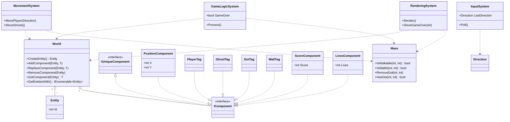

# Pac-Man ECS Console Game

Welcome to the **Pac-Man ECS Console Game** repository!  
This project is a modern, testable, and extensible implementation of the classic Pac-Man game in C#, designed for the command line and built to help you learn:

- **C# best practices**
- **Clean Code**
- **SOLID principles**
- **The Entity Component System (ECS) pattern**
- **Unit and integration testing**

---

## 🚀 Project Purpose

This repository is intended as a **learning resource** for developers interested in:
- Writing maintainable C# code
- Applying SOLID and Clean Code principles in real-world scenarios
- Understanding and implementing the ECS pattern
- Building testable and modular applications
- Experimenting with console rendering and input handling

---

## 🎮 Features

- **Classic Pac-Man gameplay**: Move, collect dots, avoid ghosts, win or lose!
- **Entity Component System architecture**: Decouples data, behavior, and identity for maximum flexibility and testability
- **Clean, SOLID codebase**: Each class and method has a clear, single responsibility
- **Two rendering modes**: Emoji (colorful, modern) and ASCII (maximum compatibility)
- **Command-line options**: Choose your render mode at startup
- **Comprehensive tests**: Unit and integration tests using NUnit and FluentAssertions
- **Easy extensibility**: Add new features, systems, or components with minimal changes

---

## 🧑‍💻 Learning Outcomes

By exploring this project, you will:

- **Understand the ECS pattern**: Learn how to separate entities, components, and systems for scalable game (or app) design
- **Apply SOLID principles**: See how Single Responsibility, Open/Closed, and other SOLID principles work in practice
- **Write and run tests**: Discover how to write unit, integration, and E2E tests for a console application
- **Handle command-line arguments**: Learn how to make your apps configurable and user-friendly
- **Work with console input/output**: See how to create interactive C# console applications

---

## 🏗️ PacMan.Game class diagram



---

## 🕹️ How to Run

1. **Clone the repository:**
    ```
    git clone https://github.com/ChaosHelme/PacMan-Learning.git
    cd pacman-learning
    ```

2. **Build and run the game:**
    ```
    dotnet run -- --render-mode emoji
    ```
    - Use `--render-mode ascii` for ASCII rendering (default if not specified).

3. **Controls:**
    - Use arrow keys or WASD to move
    - Press `Q` to quit

---

## 🧪 How to Test

1. **Run all tests:**
    ```
    dotnet test
    ```

    - The project includes unit, integration, and end-to-end tests using [NUnit](https://nunit.org/) and [FluentAssertions](https://fluentassertions.com/).

---

## 🏆 What You'll Learn

- **ECS Pattern:**  
  How to build games and apps with maximum flexibility by separating data, identity, and behavior.

- **Clean Code & SOLID:**  
  How to write code that is easy to read, test, extend, and maintain.

- **Testing:**  
  How to write robust tests for both individual units and the whole application.

- **C# Console Programming:**  
  How to handle input, output, and rendering in a console environment.

---

## 📚 Further Reading

- [Game Programming Patterns: ECS](https://www.simplilearn.com/entity-component-system-introductory-guide-article)
- [SOLID Principles in C#](https://scotch.io/bar-talk/s-o-l-i-d-the-first-five-principles-of-object-oriented-design)
- [Clean Code by Robert C. Martin](https://www.oreilly.com/library/view/clean-code/9780136083238/)
- [NUnit Documentation](https://docs.nunit.org/)
- [FluentAssertions Documentation](https://fluentassertions.com/)

---

## 🤝 Contributing

Contributions, suggestions, and questions are welcome!  
Feel free to open issues or pull requests to help improve this learning resource.

---

## 📜 License

This project is licensed under the MIT License.  
See [LICENSE](LICENSE) for details.

---

**Happy Learning and Coding!**
